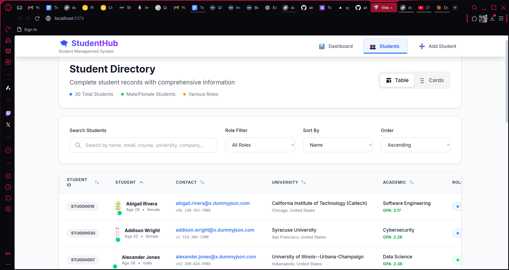

# 🎓 Quorium - Student Management System


A comprehensive, modern student management system built with React.js and Vite. Quorium provides an intuitive interface for managing student records, tracking academic progress, and generating insightful analytics.

## 📸 Screenshots

### Dashboard Overview

*Professional dashboard with statistics, course overview, and performance metrics*

### Student Directory - Table View

*Comprehensive student directory with advanced filtering and search capabilities*

### Student Directory - Card View

*Clean card-based view with responsive design and detailed student information*

### Student Details Modal

*Professional modal with comprehensive student information across multiple categories*

### Add New Student

*Streamlined student registration form with validation and professional UI*

## ✨ Features

### 🏠 **Dashboard**
- **Real-time Statistics**: Live metrics for total students, active enrollments, courses, and graduations
- **Course Analytics**: Comprehensive course overview with student distribution
- **Performance Metrics**: Visual progress bars for enrollment rates, graduation rates, and course diversity
- **Quick Actions**: Direct navigation to key functionalities
- **Interactive Elements**: Expandable course lists with "Show All" functionality

### 👥 **Student Management**
- **Dual View Modes**: Switch between table and card views
- **Advanced Search**: Multi-field search across names, emails, courses, universities, and companies
- **Smart Filtering**: Filter by student status (Active, Inactive, Graduated, Suspended)
- **Comprehensive Sorting**: Sort by name, age, GPA, enrollment date, and status
- **Detailed Profiles**: Complete student information including personal, academic, contact, and technical details

### 📊 **Data Integration**
- **External API Integration**: Fetches comprehensive data from DummyJSON API
- **Fallback System**: Automatic fallback to mock data if API is unavailable
- **Real-time Updates**: Dynamic statistics and course data based on current student roster

### 🎨 **User Experience**
- **Professional Design**: Clean, modern interface with consistent styling
- **Responsive Layout**: Fully responsive design that works on all devices
- **Interactive Components**: Hover effects, smooth transitions, and intuitive navigation
- **Accessibility**: WCAG compliant design with proper contrast and keyboard navigation

### 🔧 **Technical Features**
- **Modern React**: Built with React 18+ using functional components and hooks
- **Vite Build System**: Lightning-fast development and build process
- **Tailwind CSS**: Utility-first CSS framework for rapid UI development
- **Component Architecture**: Modular, reusable components for maintainability

## 🛠️ Technology Stack

| Technology | Purpose | Version |
|------------|---------|---------|
| **React** | Frontend Framework | 18.3.1 |
| **Vite** | Build Tool & Dev Server | 5.4.1 |
| **Tailwind CSS** | Styling Framework | 3.4.10 |
| **JavaScript (ES6+)** | Programming Language | Latest |
| **Node.js** | Runtime Environment | 21+ |

## 📋 Prerequisites

Before running this project, ensure you have the following installed:

- **Node.js**: Version 21 or higher
- **npm**: Package manager (comes with Node.js)
- **Git**: Version control system

### Checking Your Node.js Version
```bash
node --version
# Should return v21.x.x or higher
```

### Installing Node.js 21
If you don't have Node.js 21 or higher:

**Using nvm (recommended):**
```bash
# Install nvm if you haven't already
curl -o- https://raw.githubusercontent.com/nvm-sh/nvm/v0.39.0/install.sh | bash

# Install and use Node.js 21
nvm install 21
nvm use 21
```

**Direct Download:**
Visit [Node.js official website](https://nodejs.org/) and download version 21+

## 🚀 Installation & Setup

### 1. Clone the Repository
```bash
git clone https://github.com/akshatgg/Quorium.git
cd Quorium
```

### 2. Install Dependencies
```bash
npm install
```

### 3. Start Development Server
```bash
npm run dev
```

### 4. Open in Browser
Navigate to [http://localhost:5173](http://localhost:5173) in your web browser.

## 📁 Project Structure

```
Quorium/
├── public/
│   └── vite.svg
├── src/
│   ├── components/
│   │   ├── AddStudent.jsx       # Student registration form
│   │   ├── Dashboard.jsx        # Main dashboard with analytics
│   │   ├── Navigation.jsx       # Top navigation bar
│   │   ├── StudentDetail.jsx    # Student detail modal
│   │   └── StudentsList.jsx     # Student directory (table/cards)
│   ├── utils/
│   │   └── studentUtils.js      # Utility functions and data handling
│   ├── App.jsx                  # Main application component
│   ├── App.css                  # Global styles
│   ├── index.css               # Base CSS and Tailwind imports
│   └── main.jsx                # Application entry point
├── docs/                       # Screenshots and documentation
├── package.json               # Project dependencies and scripts
├── tailwind.config.js         # Tailwind CSS configuration
├── vite.config.js            # Vite configuration
└── README.md                 # This file
```

## 🎯 Key Components

### Dashboard
- **Statistics Cards**: Display key metrics with visual indicators
- **Course Overview**: Expandable list showing all available courses
- **Quick Actions**: Direct access to add students and view directory
- **Performance Metrics**: Visual progress indicators for key KPIs

### Student Directory
- **Table View**: Comprehensive tabular display with sorting and filtering
- **Card View**: Visual card-based layout with responsive design
- **Search & Filter**: Advanced search across multiple fields
- **Pagination**: Efficient navigation through large student datasets

### Student Management
- **Add Student**: Complete form with validation for new registrations
- **Edit Student**: Inline editing capabilities for existing records
- **Delete Student**: Secure deletion with confirmation dialogs
- **View Details**: Comprehensive modal with all student information

## 📊 Data Sources

### Primary Data Source
- **DummyJSON API**: [https://dummyjson.com/users](https://dummyjson.com/users)
- Provides realistic user data including personal, academic, and professional information

### Fallback System
- **Mock Data Generator**: Automatic generation of sample data if API is unavailable
- Ensures application functionality regardless of network conditions

## 🎨 Design System

### Color Palette
- **Primary**: Blue gradient (#3B82F6 to #8B5CF6)
- **Success**: Green (#10B981)
- **Warning**: Amber (#F59E0B)
- **Error**: Red (#EF4444)
- **Neutral**: Gray scale (#F9FAFB to #111827)

### Typography
- **Font Family**: Inter, system-ui, sans-serif
- **Font Weights**: 400 (normal), 500 (medium), 600 (semibold), 700 (bold)
- **Responsive Scaling**: Fluid typography that adapts to screen size

### Component Patterns
- **Cards**: Consistent shadow, border radius, and hover effects
- **Buttons**: Primary, secondary, and danger variants with proper states
- **Forms**: Consistent input styling with validation states
- **Modals**: Professional overlay design with backdrop blur

## 🚀 Available Scripts

| Script | Description |
|--------|-------------|
| `npm run dev` | Start development server with hot reload |
| `npm run build` | Create production build |
| `npm run preview` | Preview production build locally |
| `npm run lint` | Run ESLint for code quality checks |

## 🔧 Configuration

### Vite Configuration
```javascript
// vite.config.js
export default {
  plugins: [react()],
  server: {
    port: 5173,
    host: true
  }
}
```

### Tailwind Configuration
```javascript
// tailwind.config.js
module.exports = {
  content: ["./index.html", "./src/**/*.{js,ts,jsx,tsx}"],
  theme: {
    extend: {
      fontFamily: {
        sans: ['Inter', 'system-ui', 'sans-serif']
      }
    }
  },
  plugins: []
}
```

## 🌟 Key Features Breakdown

### Dashboard Analytics
- **Student Statistics**: Real-time count of total, active, and graduated students
- **Course Metrics**: Dynamic course listing with enrollment statistics
- **Performance Indicators**: Visual progress bars for key performance metrics
- **Quick Navigation**: One-click access to major application sections

### Advanced Student Directory
- **Multi-view Support**: Toggle between table and card layouts
- **Comprehensive Search**: Search across names, emails, courses, universities, companies
- **Status Filtering**: Filter by Active, Inactive, Graduated, or Suspended status
- **Smart Sorting**: Sort by name, age, GPA, enrollment date, or status
- **Detailed Profiles**: Complete student information in professional modal layout

### Professional UI/UX
- **Consistent Design Language**: Unified color scheme and typography
- **Responsive Design**: Optimal viewing on desktop, tablet, and mobile
- **Interactive Elements**: Smooth hover effects and transitions
- **Accessibility**: WCAG 2.1 AA compliant design patterns

## 🎯 Use Cases

### Educational Institutions
- **Student Registration**: Streamlined enrollment process
- **Academic Tracking**: Monitor student progress and performance
- **Course Management**: Overview of course enrollment and completion rates
- **Administrative Reports**: Generate insights for institutional planning

### Training Organizations
- **Participant Management**: Track training participants and their progress
- **Course Analytics**: Monitor training program effectiveness
- **Certification Tracking**: Manage completion and graduation status
- **Performance Metrics**: Analyze training outcomes and success rates

## 🔍 Browser Support

| Browser | Minimum Version |
|---------|----------------|
| Chrome | 90+ |
| Firefox | 88+ |
| Safari | 14+ |
| Edge | 90+ |

## 📱 Responsive Design

- **Mobile First**: Optimized for mobile devices (320px+)
- **Tablet Support**: Enhanced experience on tablets (768px+)
- **Desktop Optimization**: Full feature set on desktop (1024px+)
- **Large Screens**: Optimal layout for large displays (1440px+)

## 🛡️ Security Considerations

- **Data Validation**: Client-side validation for all form inputs
- **Secure State Management**: Proper state handling to prevent data leaks
- **XSS Protection**: Sanitized data rendering throughout the application
- **HTTPS Ready**: Prepared for secure deployment with HTTPS

## 🚀 Deployment

### Build for Production
```bash
npm run build
```

### Deploy to Vercel
```bash
npm install -g vercel
vercel --prod
```

### Deploy to Netlify
```bash
npm run build
# Upload dist/ folder to Netlify
```

## 📈 Performance Optimizations

- **Code Splitting**: Automatic code splitting with Vite
- **Asset Optimization**: Optimized images and static assets
- **Bundle Analysis**: Tree shaking for minimal bundle size
- **Caching Strategy**: Efficient browser caching for static resources

## 🤝 Contributing

1. Fork the repository
2. Create your feature branch (`git checkout -b feature/AmazingFeature`)
3. Commit your changes (`git commit -m 'Add some AmazingFeature'`)
4. Push to the branch (`git push origin feature/AmazingFeature`)
5. Open a Pull Request

## 📄 License

This project is licensed under the MIT License - see the [LICENSE](LICENSE) file for details.

## 👨‍💻 Author

**Akshat Gupta**
- GitHub: [@akshatgg](https://github.com/akshatgg)
- LinkedIn: [Akshat Gupta](https://linkedin.com/in/akshatgg)

## 🙏 Acknowledgments

- **DummyJSON API** for providing realistic test data
- **Tailwind CSS** for the amazing utility-first CSS framework
- **React Team** for the incredible frontend framework
- **Vite** for the lightning-fast build tool

## 📞 Support

If you encounter any issues or have questions:

1. Check the [Issues](https://github.com/akshatgg/Quorium/issues) page
2. Create a new issue with detailed description
3. Contact the development team

---

<div align="center">
  <p>Made with ❤️ by Akshat Gupta</p>
  <p>© 2025 Quorium. All rights reserved.</p>
</div>
